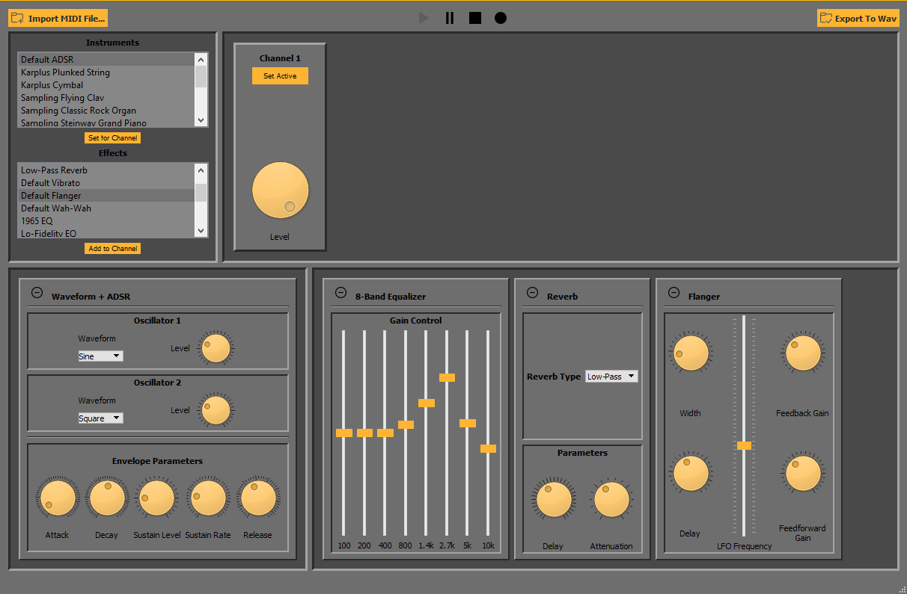
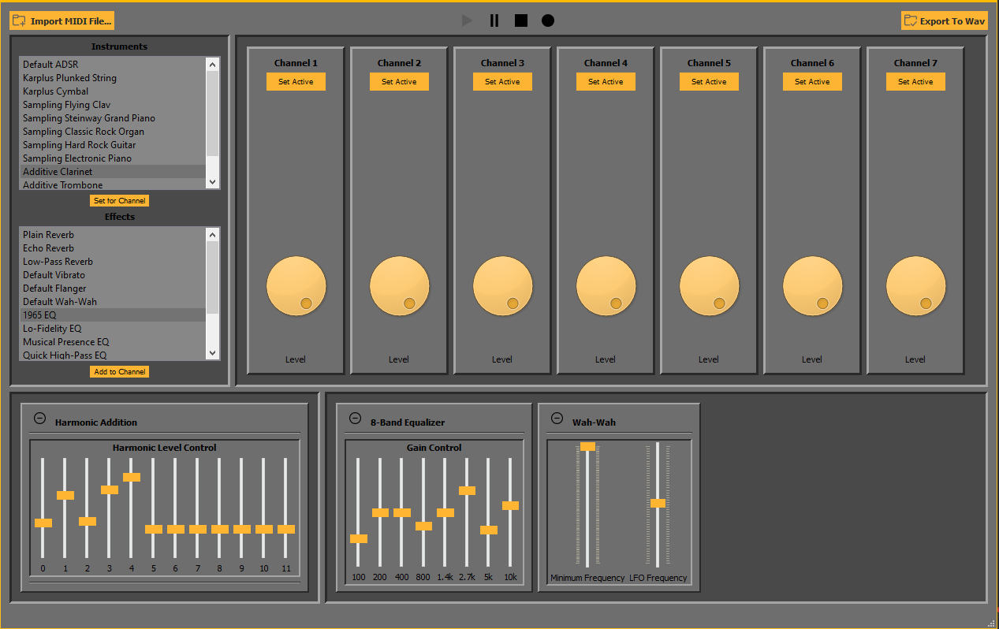

# Leandro: ableton-style audio synthesis software

<a href="https://creativecommons.org/licenses/by-nc-sa/4.0/?ref=chooser-v1"></a>

Leandro is a piece of software that explores different methods of audio synthesis and different audio filters, written entirely in C++, using portaudio and Qt.

It synthesizes notes from MIDI files using its own instruments and audio filters. After importing a .MIDI file, the user can choose from the different synthesizing methods and combine any number of filters and the melody will be generated accordingly.

Everyone loves images, so here's a screenshot of Leandro's main screen in action:



Leandro also supports multi-channel MIDI files, and allows for each channel to have its own synthesis method and assortment of audio filters:



After experimenting with different "instruments" and filters, you might like what you hear: the session's recording can be started and stopped at any point, and .wav files can be saved with the contents of those recordings.

# Contact
>[Table of contents](#table-of-contents)

Please do not hesitate to reach out to me if you find any issue with the code or if you have any questions.

* Personal email: [ianczdiaz@gmail.com](mailto:ianczdiaz@gmail.com)

* LinkedIn Profile: [https://www.linkedin.com/in/iancraz/](https://www.linkedin.com/in/iancraz/)

# License
>[Table of contents](#table-of-contents)

<a href="https://creativecommons.org/licenses/by-nc-sa/4.0/?ref=chooser-v1"></a>

<p xmlns:cc="http://creativecommons.org/ns#" xmlns:dct="http://purl.org/dc/terms/"><a property="dct:title" rel="cc:attributionURL" href="https://github.com/iancraz/Music-Synthesizer">Music Synthesizer</a> by <a rel="cc:attributionURL dct:creator" property="cc:attributionName" href="https://www.linkedin.com/in/iancraz/">Ian C. Diaz</a> is licensed under <a href="https://creativecommons.org/licenses/by-nc-sa/4.0/?ref=chooser-v1" target="_blank" rel="license noopener noreferrer" style="display:inline-block;">CC BY-NC-SA 4.0</a></p>

```
You are free to:
    Share — copy and redistribute the material in any medium or format

    Adapt — remix, transform, and build upon the material

The licensor cannot revoke these freedoms as long as you follow the license terms.
Under the following terms:
    Attribution — You must give appropriate credit , provide a link to the license,
    and indicate if changes were made. You may do so in any reasonable manner, but 
    not in any way that suggests the licensor endorses you or your use.

    NonCommercial — You may not use the material for commercial purposes.

    ShareAlike — If you remix, transform, or build upon the material, you must 
    distribute your contributions under the same license as the original.

    No additional restrictions — You may not apply legal terms or technological 
    measures that legally restrict others from doing anything the license permits.

Notices:

You do not have to comply with the license for elements of the material in the 
public domain or where your use is permitted by an applicable exception or 
limitation.

No warranties are given. The license may not give you all of the permissions 
necessary for your intended use. For example, other rights such as publicity, 
privacy, or moral rights may limit how you use the material.
```
